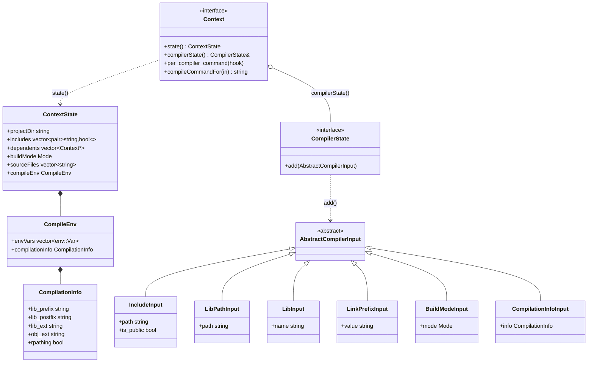
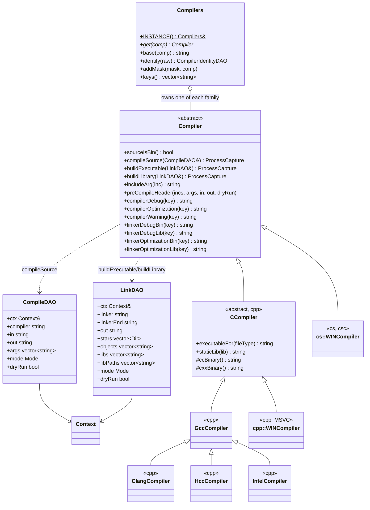

# `mkn/kul/lang/cpp/compiler.hpp` — Compiler Backend Hierarchy

**Namespaces:** `mkn::kul::lang` (shared contract), `mkn::kul::lang::cpp` (C++ backends), `mkn::kul::lang::cs` (C# backend)

A single `Compiler` hierarchy — and the `Context`/`CompilerState` surface it runs against — is shared between `maiken` itself and out-of-tree `mkn.mod` modules. Neither side depends on the other's headers: a module built only against `mkn.kul` can read/mutate the exact same project state a real build uses.

## Overview



`Context` is deliberately small: everything a `Module` (or a `Compiler` backend) reads crosses the boundary as one `ContextState` snapshot from `state()`, and everything it mutates goes through one `add(AbstractCompilerInput const&)` call on the `CompilerState&` returned by `compilerState()`. Adding a new kind of mutation means adding a new `AbstractCompilerInput` subtype, not a new virtual on `Context`.

`maiken::Application` does **not** inherit `Context`/`CompilerState` itself — it owns a small `maiken::ApplicationContext` adapter (`app.context()`) that implements both by forwarding to `Application`'s own plain methods (`addInclude`, `addLibpath`, `mode()`, `envVars()`, ...). This keeps `Application` from having to grow to satisfy either interface.

## Compiler hierarchy



`executableFor(fileType)` replaces separate `cc()`/`cxx()` accessors: it classifies `fileType` as C (`c`, `h`) or C++ (`cpp`, `cc`, `cxx`, `hpp`, `hh`, `hxx`) and dispatches to the protected `ccBinary()`/`cxxBinary()` for that family, throwing `cpp::Exception` for anything else. `Compilers::identify(raw)` splits a config string like `"ccache g++-10 -std=c++17"` into `{prefix, binary, trailing, family}` so wrapper prefixes (ccache, distcc, ...) and baked-in trailing flags never need special-casing elsewhere.

## API reference

### `mkn::kul::lang` (`def.hpp`, `compiler.hpp`)

| Symbol | Kind | Notes |
|---|---|---|
| `Mode` | enum | `NONE`, `STAT`, `SHAR` |
| `mode_from(mode, shared_str="shared", static_str="static")` | free fn | string → `Mode` |
| `CompilationInfo` | struct | `lib_prefix`, `lib_postfix`, `lib_ext`, `obj_ext`, `rpathing` |
| `CompileCommand` | struct | `compiler`, `in`, `out`, `args`, `dryRun` — payload of `per_compiler_command`'s hook |
| `CompileEnv` | struct | `envVars`, `compilationInfo` |
| `ContextState` | struct | full read-only snapshot returned by `Context::state()` |
| `AbstractCompilerInput` | abstract struct | tag base for `CompilerState::add()`; polymorphic (has a vtable) so `dynamic_cast` can dispatch on it |
| `IncludeInput`, `LibPathInput`, `LibInput`, `LinkPrefixInput`, `BuildModeInput`, `CompilationInfoInput` | structs | concrete `AbstractCompilerInput`s |
| `Context` | abstract class | `state()`, `compilerState()`, `per_compiler_command(hook)`, `compileCommandFor(in)` |
| `CompilerState` | abstract class | `add(AbstractCompilerInput const&)` |
| `ProcessCapture` | class | `mkn::kul::ProcessCapture` + `exception()`/`cmd()`/`file()` |
| `CompileDAO` / `LinkDAO` | structs | inputs to `Compiler::compileSource`/`buildExecutable`/`buildLibrary` — hold `Context const&`, never `Application` |
| `Compiler` | abstract class | see diagram above |

### `mkn::kul::lang::cpp`

| Symbol | Notes |
|---|---|
| `CCompiler_Type` | `NON`, `GCC`, `CLANG`, `ICC`, `HCC`, `WIN` |
| `CCompiler` | adds `executableFor`, `staticLib`, `libName`, `oType`/`oStar`, `type()`, static `CC`/`CXX`/`LD` env-override helpers |
| `GccCompiler` | `gcc`/`g++`; also base for `ClangCompiler`, `HccCompiler`, `IntelCompiler` (only override `ccBinary`/`cxxBinary`/`type`) |
| `WINCompiler` | MSVC (`cl`); `compileSource`/`buildExecutable`/`buildLibrary` fully self-contained (no `Compilers::INSTANCE()` lookup) |
| `Compilers` | singleton registry: family name/alias → `Compiler*`; `identify()`/`split()`/`key()`/`matchesFamily()` resolve a raw compiler string to a family |
| `CompilerIdentityDAO` | `{prefix, binary, trailing, family}` — result of `Compilers::identify()` |
| `CompilerNotFoundException` | thrown by `Compilers::get()`/`addMask()` |

### `mkn::kul::lang::cs`

| Symbol | Notes |
|---|---|
| `WINCompiler` | `csc`; `sourceIsBin() == true` (no separate object step); `compileSource`/`includeArg`/`preCompileHeader` throw — C# doesn't use them |

## Usage

```cpp
#include "mkn/kul/lang/cpp/compilers.hpp"

using namespace mkn::kul::lang;

auto& compilers = cpp::Compilers::INSTANCE();
auto const id = compilers.identify("ccache g++-10 -fPIC");
// id.prefix = {"ccache"}, id.binary = "g++-10", id.family = "g++"

Compiler const* comp = compilers.get("g++-10");   // resolves via family match

// A Module (or maiken itself, via ApplicationContext) mutates project state
// through one call regardless of what kind of input it is:
ctx.compilerState().add(IncludeInput{"./inc", /*is_public=*/true});
ctx.compilerState().add(LibPathInput{"/usr/local/lib"});

// ...and reads everything back through one snapshot:
auto const state = ctx.state();
for (auto const& [inc, is_public] : state.includes) { /* ... */ }
```
